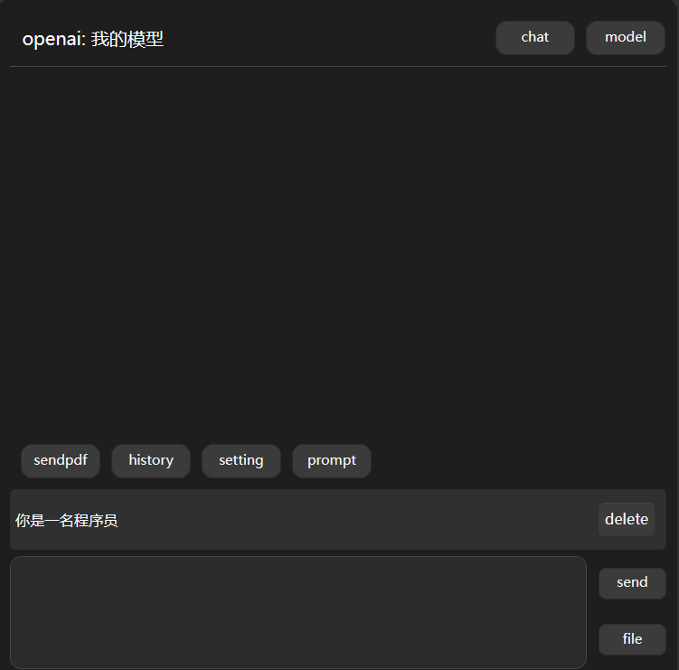
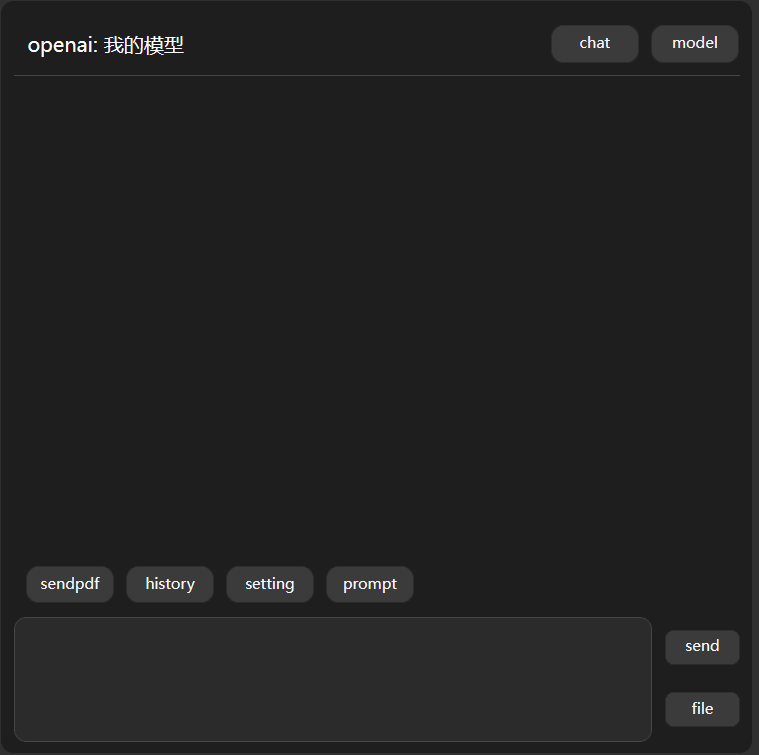
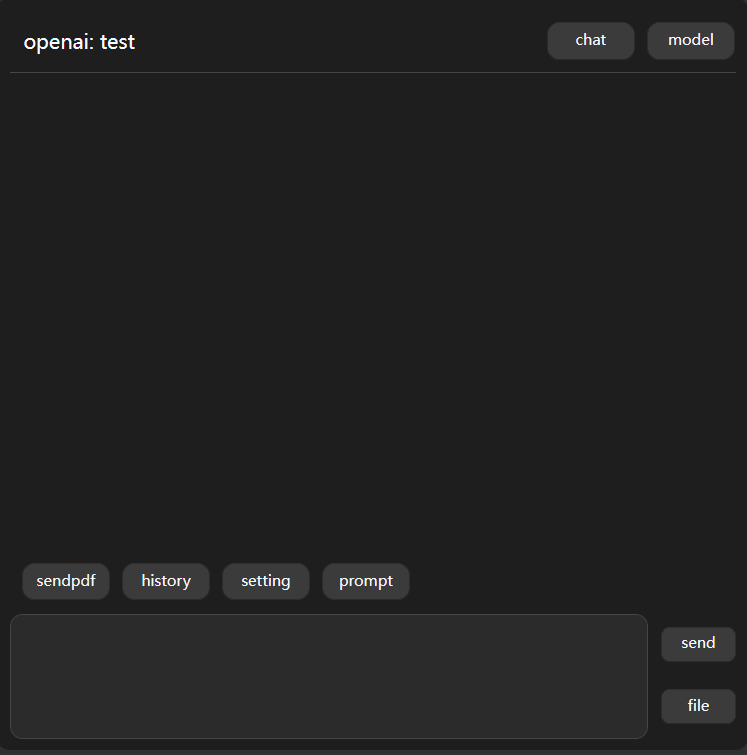
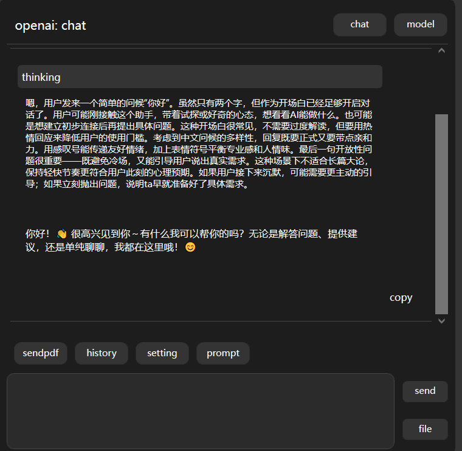
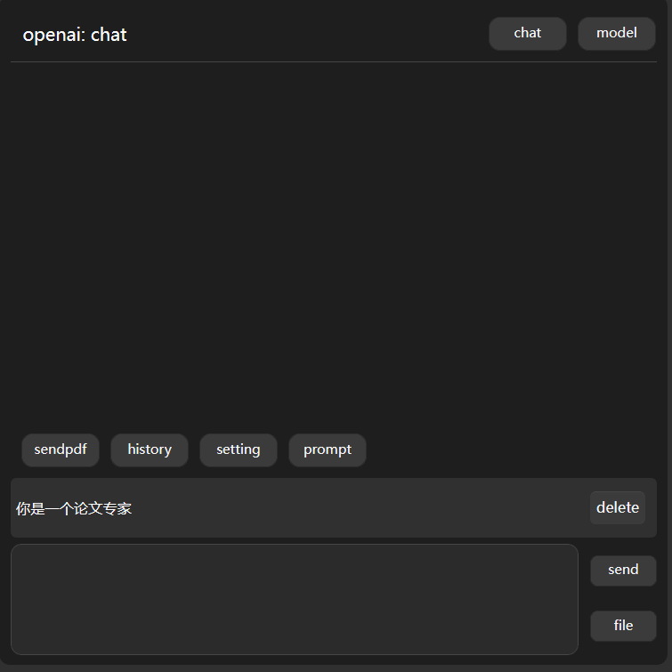
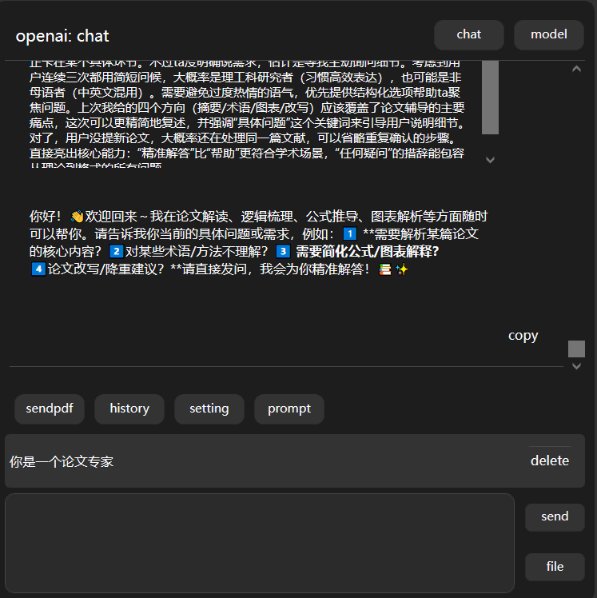

  

# Zotero Paper Agent

[简体中文](README_CN.md) | English

# What's New

- [x] [2025.4.22]🎯📢Updated plugin to version [3.0](doc/3_0_Introduction_EN.md)
- [x] [2025.4.22]🎯📢Fixed issue where DeepSeek response text failed to display
- [x] [2025.2.25]🎯📢Integrated Hailuo AI ([Hailuo AI](https://hailuoai.com/))
- [x] [2025.2.22]🎯📢Integrated full-featured version of DeepSeek
- [x] [2025.2.22]🎯📢Added thought process visualization
- [x] [2025.1.25]🎯📢Added UI refresh button to resolve interface disappearance issues
- [x] [2024.12.11]🎯📢Optimized overall UI design
- [x] [2024.12.11]🎯📢Abstracted [Kimi Apis](https://github.com/windfollowingheart/kimi-apis) as standalone module
- [x] [2024.12.11]🎯📢Added file upload cache mechanism
- [x] [2024.12.11]🎯📢Removed pop-up buttons when selecting text; moved functions to reader sidebar button menu
- [x] [2024.12.11]🎯📢Added answer stopping function and fixed several bugs

# 🚀 Key Features

Zotero Paper Agent comes with the following features:

- 🔗 **Seamless Zotero Integration**: Deeply integrated with Zotero—just click the sidebar icon to launch.
- 💬 **User-Friendly Interaction**: Ask questions directly via the input box, just like using mainstream LLM applications.
- 📄 **File Upload Support**: Upload files and query relevant information about their content.

# Quick Start

- Download the `.xpi` file from [GitHub](https://github.com/windfollowingheart/zotero-paper-agent/releases/download/v3.0.1/zotero-paper-agent.xpi) | [Gitee](https://gitee.com/windheartyolo/zotero-pape-agent/releases/download/v3.0.1/zotero-paper-agent.xpi)

# 1. Get API Key

Visit the webpage and log in via [QR code scan](https://creative-malabi-a24fac.netlify.app/)
Your `apikey` will be available immediately after successful login.

# 2. Add API Key

  

# 3. Start Chatting

  

# 4. Add Models

## OpenAI Models

  

# 5. Set Prompts

  

# 6. History Records

  

# 7. Keyword Search

  

# Video Tutorial

[Bilibili](https://www.bilibili.com/video/BV1QskqYzE2x)

# Acknowledgments

- [Zotero Plugin Template](https://github.com/windingwind/zotero-plugin-template)
- [Zotero GPT](https://github.com/MuiseDestiny/zotero-gpt)
- [Zotero Better Notes](https://github.com/windingwind/zotero-better-notes)
- [Zotero Pdf Translate](https://github.com/windingwind/zotero-pdf-translate)
- [Kimi Apis](https://github.com/windfollowingheart/kimi-apis)

---
