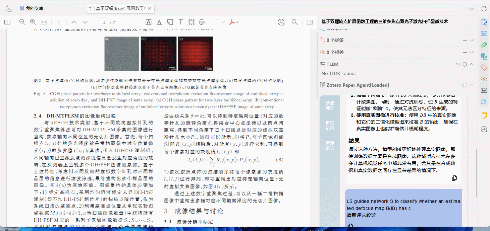
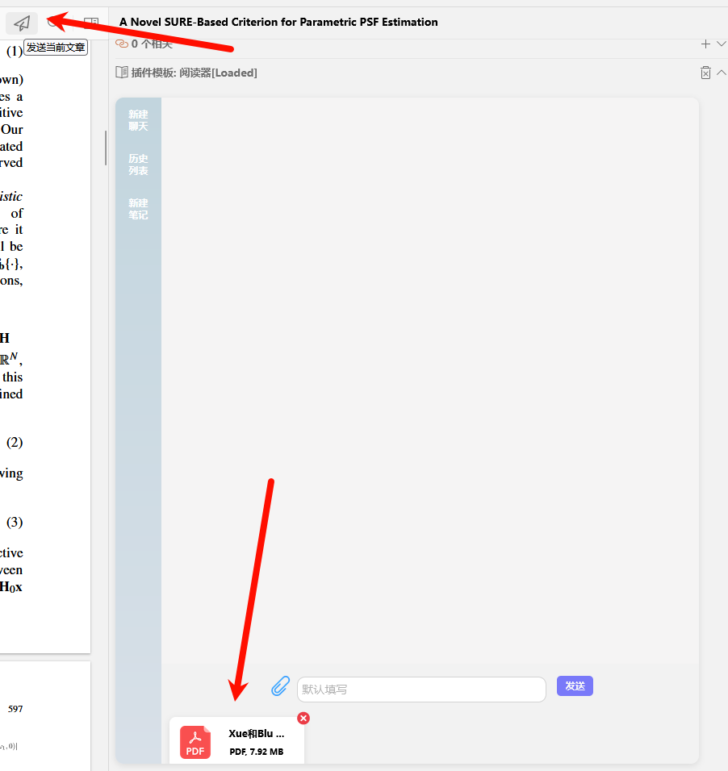

  

# Zotero Paper Agent

English | [简体中文](README_CN.md)

## What's New
- [x] [2025.1.25]🎯📢 Added a refresh interface button to resolve the issue of the interface disappearing.
- [x] [2024.12.22]🎯📢Optimized UI interface.
- [x] [2024.12.22]🎯📢Abstract except [Kimi Apis](https://github.com/windfollowingheart/kimi-apis).
- [x] [2024.12.22]🎯📢Add file upload cache.
- [x] [2024.12.22]🎯📢Remove the pop-up button when selecting text and replace it with a reader sidebar button menu.
- [x] [2024.12.11]🎯📢Add stop answering button and fix some bugs.

## 🚀 Main Features
Features about Zotero Paper Agent:  
-  🔗 **Integrate with Zotero**: This plugin is highly integrated with Zotero, simply click on the sidebar icon.
-  💬 **Easy to Use**: Ask directly through the input box, which is similar to the LLM application nowly.
-  📄 **Support File Upload**: You can upload files and ask questions about them. 

## Bug Fixes
- Refresh Interface:
  

  

## How to use
-  Get `.xpi` file there [github download latest](https://github.com/windfollowingheart/zotero-paper-agent/releases/download/v2.0.1/zotero-paper-agent.xpi) | [gitee download latest](https://gitee.com/windheartyolo/zotero-pape-agent/releases/download/v2.0.1cc/zotero-paper-agent.xpi) release `.xpi` file
  
### 1. Questions and Answers
- 

  
  
  
  

###  2. Upload Files
- 

  
  
  
  

### 3. Add New Notes
- 

  
  
  
  

## Video Tutorials
[bilibili](https://www.bilibili.com/video/BV1QskqYzE2x/)

## Thanks
- [Zotero Plugin Template](https://github.com/windingwind/zotero-plugin-template)
- [Zotero GPT](https://github.com/MuiseDestiny/zotero-gpt)
- [Zotero Better Notes](https://github.com/windingwind/zotero-better-notes)
- [Zotero Pdf Translate](https://github.com/windingwind/zotero-pdf-translate)
- [Kimi Apis](https://github.com/windfollowingheart/kimi-apis)
  
---

