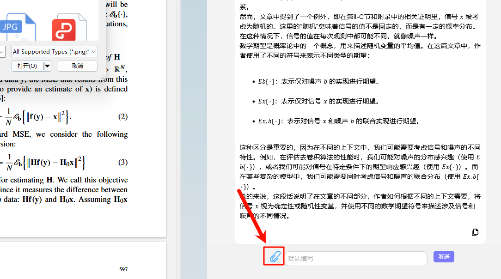

  

# Zotero Paper Agent

## 🚀 Main Features
Features about Zotero Paper Agent:  
- [x] 🔗 **Integrate with Zotero**: This plugin is highly integrated with Zotero, simply click on the sidebar icon.
- [x] 💬 **Easy to Use**: Ask directly through the input box, which is similar to the LLM application nowly.
- [x] 📄 **Support File Upload**: You can upload files and ask questions about them. 

## How to use
- [x] Get `.xpi` file there [download latest](https://github.com/windfollowingheart/zotero-paper-agent/releases/download/v1.0.0/zotero-paper-agent.xpi) release `.xpi` file
  
- [x] 问答
- 

  
  
  
  

- [x] 文件上传
  

  
  
  

- [x] 新建笔记
  

  
  
  
  

## Video Tutorials
[bilibili](https://www.bilibili.com/video/BV1oszpYaEhH/)

## Thanks
- [Zotero Plugin Template](https://github.com/windingwind/zotero-plugin-template)
- [Zotero GPT](https://github.com/MuiseDestiny/zotero-gpt)
- [Zotero Better Notes](https://github.com/windingwind/zotero-better-notes)
- [Zotero Pdf Translate](https://github.com/windingwind/zotero-pdf-translate)
  

